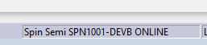
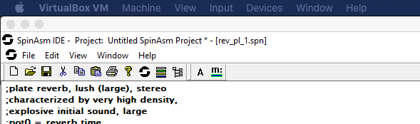
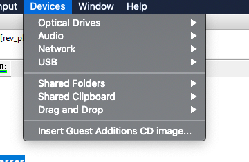
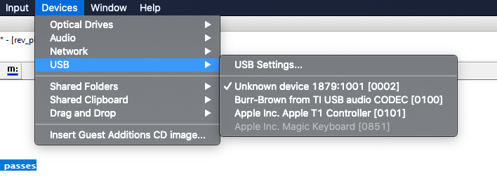
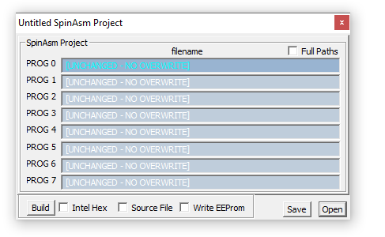

# Fundamentals

The assumption here is that you have an FV-1 development board

## Save your projects to Github

- use host machine
- make shared folder a git repo
- use as normal
- what to put in .gitignore? not sure yet...

## Connecting your FV-1 to your windows machine

Make sure you connect the FV-1 to your laptop, you should see the status bar update to show the FV-1 is 'online'.

If the FV-1 is not connected,  the `devices` menu on the top menu bar

Then select the `USB` menu item, where you will probably see a number of well-named devices and one that is called `Unknown Device` - this is your FV-1, click on it to allow the virtual machine connect to it.

## Loading a program onto the FV-1

https://www.diystompboxes.com/smfforum/index.php?topic=108891.0

## setting up a project with multiple programs in SpanASM IDE

