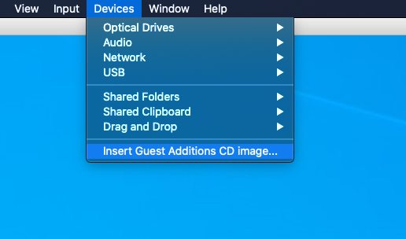
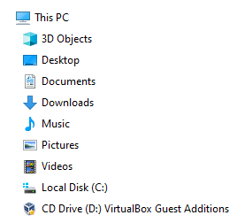
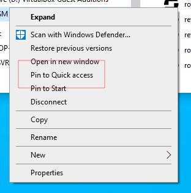
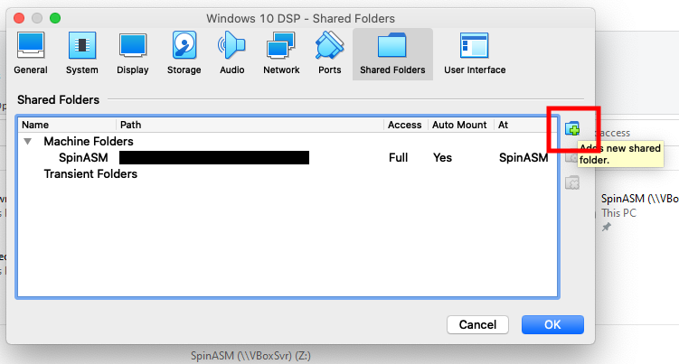
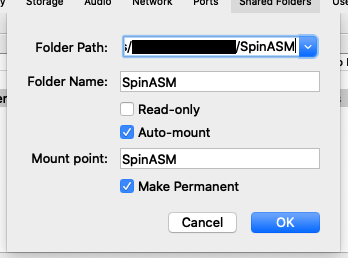

# Preparation

The assumption here is you are running on Macos

## Running SpinASM IDE on a Mac

The SpinASM IDE (integrated development environment) used to program the EEProm chips is a windows executable - you can see from comments in the thread below that the best way to run it on a Mac is using a windows virtual machine.

http://spinsemi.com/forum/viewtopic.php?t=777

There are lots of other tantalising tidbits of information in that post - we'll revisit later...

### Creating your virtual machine

Download [Virtualbox](https://www.virtualbox.org/wiki/Downloads) and [Windows 10](https://www.microsoft.com/en-us/software-download/windows10ISO). Create a new Virtual machine and make sure you give it enough disk space - windows is _very_ hungry. Stupidly, I started with 15GB which was eaten in the first hours - use the 50GB suggestion.

### Guest Additions

Once you have the machine installed and setup (Cortana driven setup is...) you should add the VirtualBox 'Guest additions'. In the `Devices` menu click on `Insert Guest Additions CD Images...`

This is instantaneous so you will see no progress bar or other indicator. If it worked - no reason it should not - you will see the CD mounted in 'File Explorer'.

Run the installation and allow it to reboot.

### Point your SpinASM IDE at your shared folders

- add to quick view
- create folders in your mac finder or windows file manager
- update each folder
- probably add your shared folder to github
- copy existing files from SpinASM IDE default folders `C:\Program Files (x86)\SpinAsm IDE\`